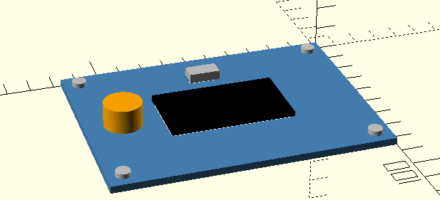

# idrcad

Describe what must fit, align, and stay apart. `idrcad` solves the missing
dimensions and positions, checks the result, and emits ordinary OpenSCAD.



```idrcad
model front_panel

panel = plate(
  width = 70mm..150mm,
  depth = 50mm..100mm,
  height = 3mm
)

display = cutout(width = 52mm, depth = 30mm, clearance = 0.25mm) in panel
usb = cutout(width = 13mm, depth = 7mm, clearance = 0.20mm) in panel
encoder = bore(radius = 4mm) in panel
screws = corner_bores(radius = 1.6mm, edge = 5mm) in panel

center display in panel
usb below display by 8mm
encoder right_of display by 12mm
space [display, usb, encoder, screws] by 4mm
minimize panel
```

No Idris knowledge is required to write a `.idrcad` model. Idris remains
behind the language as its type checker and trusted model builder.

## Try it

```sh
nix develop "path:$PWD"
make build

./build/exec/idrcad check examples/front-panel/front-panel.idrcad
./build/exec/idrcad build examples/front-panel/front-panel.idrcad > front-panel.scad
openscad front-panel.scad
```

The front-panel example derives a `116.9 × 85.7 × 3 mm` plate and all
component positions. `build` invokes MiniZinc itself, independently validates
the returned integer solution, and substitutes it into the OpenSCAD output.

Use `idrcad minizinc FILE.idrcad` to inspect the generated constraint model.
The complete language reference is in [docs/language.md](docs/language.md).

## Why idrcad?

- Write relationships such as `center`, `right_of`, and `space`, with exact
  dimensions and clearances
  instead of synchronising coordinates by hand.
- Leave dimensions and positions partially specified for the solver.
- Get source-located parse and semantic errors for unknown names, invalid
  feature relationships, bad ranges, and excessive decimal precision.
- Model tolerances without floating point: one millimetre is exactly
  `1,000,000` arbitrary-precision integer ticks.
- Recheck every solver result before it reaches generated geometry.
- Use the Idris API directly when the small language is not expressive enough.

The solver fragment supports comparisons, addition, subtraction, negation,
whole-number coefficients, and native 2D non-overlap. Division, products of
unknowns, and fractional solver coefficients are rejected.

## Examples

- [`examples/front-panel`](examples/front-panel): the same solver-driven panel
  in the textual language and the advanced Idris API.
- [`examples/partial-fit`](examples/partial-fit): a known plate and hole with
  a solver-sized matching cylinder.
- [`examples/constrained-fitting`](examples/constrained-fitting): a toleranced
  clearance fit.
- The [coverage map](docs/examples.md) links Idris ports to all 50 pinned
  upstream OpenSCAD examples.

```sh
make list
make test
```

The pinned Nix shell includes Idris 2, `idris2-lsp`, `idris2-parser`, and
MiniZinc. The Idris modules remain available as an advanced, fully typed
authoring API.
